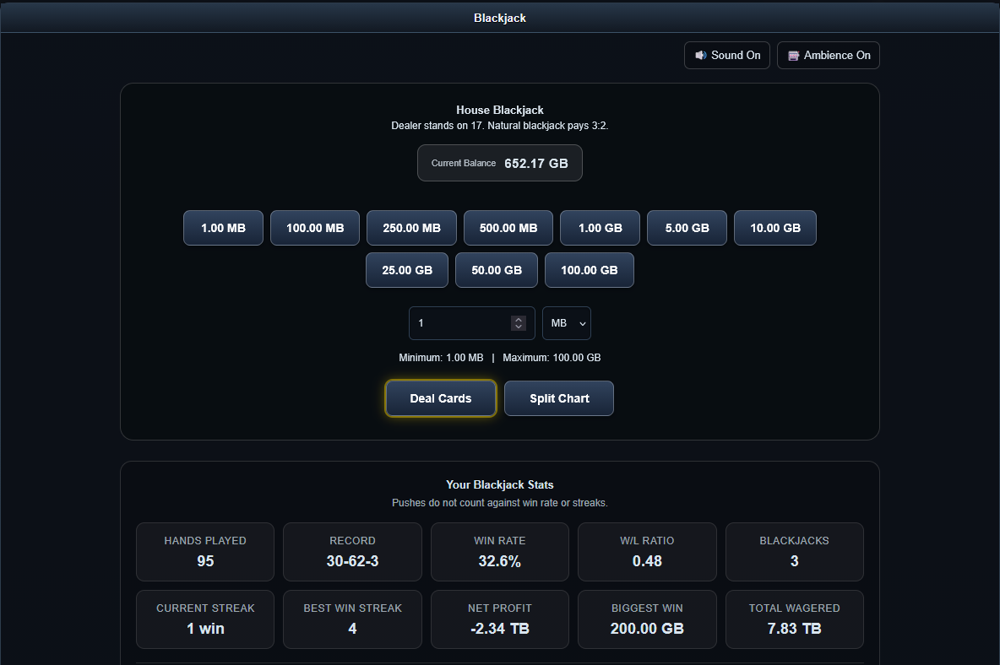
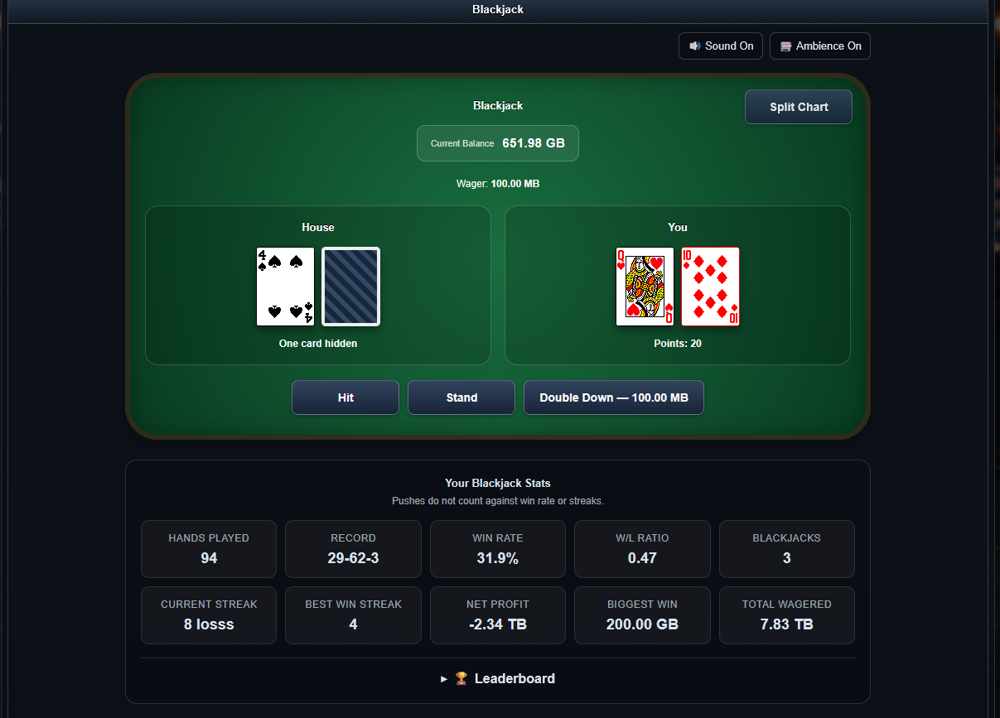
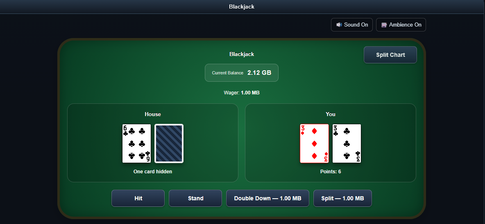
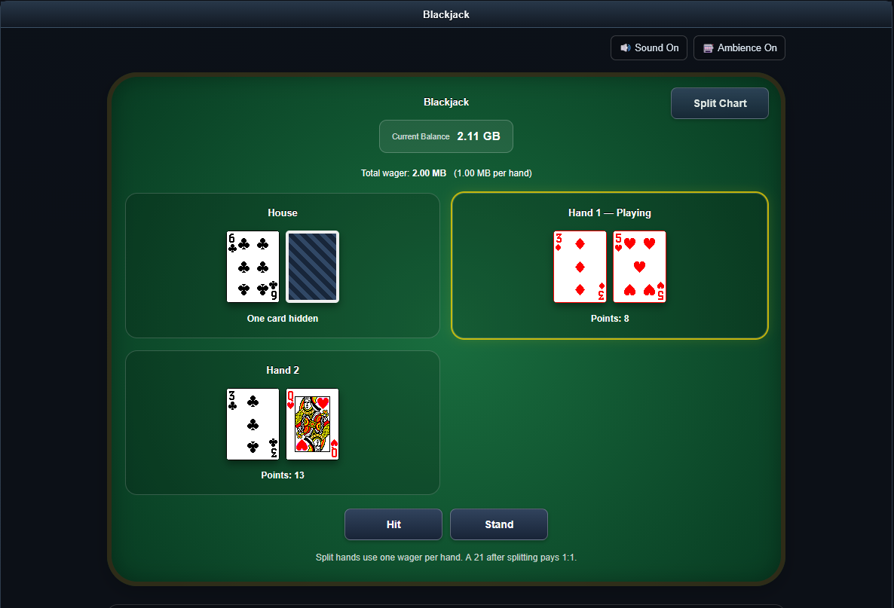
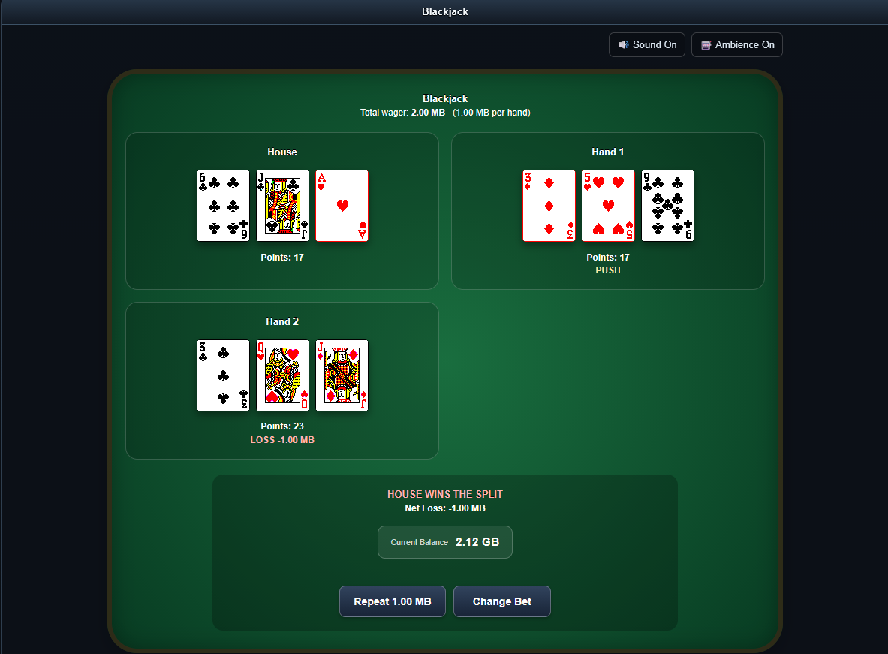

# TTv3.x Blackjack

<figure>

<figcaption aria-hidden="true">TTv3.x Blackjack</figcaption>
</figure>

## Compatibility

> **PHP 8.x Compatible**
>
> Built for TTv3 / TTv3.x.

- PHP 8.x
- MySQL or MariaDB

## Features

- Single-player Blackjack against the house
- Uses tracker upload credit as the player’s balance
- Configurable minimum and maximum wagers
- MB / GB wager selection
- Whole-number custom wagers
- Quick-bet buttons automatically respect configured limits
- Natural Blackjack pays **3:2**
- Dealer stands on **17**
- **Hit**
- **Stand**
- **Double Down**
- **Split**
- Split Aces support
- Split-hand results and payouts
- Split strategy chart
- Repeat Bet and Change Bet controls
- Card animations
- Card placement, win, loss, push, Blackjack, and flip sounds
- Casino room ambience with an independent on/off control
- Sound preferences saved in the browser
- Player statistics
- Leaderboard
- Admin-selectable player stat resets
- CSRF protection
- Transactional balance handling
- One active house game per player
- WebP playing-card artwork
- AJAX-style gameplay without full-page reloads

## Gameplay Screenshots

### Betting and Player Stats

Quick bets, custom MB / GB wagers, configurable limits, persistent sound controls, and player statistics.


### Active Hand

A normal hand in progress with **Hit**, **Stand**, and **Double Down** available.



### Split

When the opening cards are a valid pair, **Split** becomes available.



### Split in Progress

Each split hand is played separately against the dealer.



### Split Result

Split hands settle independently and the game shows the combined net result. Repeat Bet returns to the original base wager.



### Administrator Stat Reset

User class 7 or higher can selectively reset a player's Blackjack statistics without changing upload credit or an active hand.


## Player Statistics

The game tracks:

- Hands played
- Win / loss / push record
- Win rate
- Win/loss ratio
- Current streak
- Best win streak
- Net profit
- Biggest win
- Total wagered
- Natural Blackjacks

Pushes do not count against win rate or streaks.

## Betting Limits

Betting limits are controlled entirely through the site config:

``` php
$site_config['blackjack_min_bet'] = 1 * MB;
$site_config['blackjack_max_bet'] = 100 * GB;
```

The configured maximum applies to normal wagers and **Double Down**.

Split wagers: Splitting requires an additional wager equal to your original bet. A split is always allowed on a valid pair if you have enough upload credit, even when your original bet is already at the maximum. The maximum bet applies to each hand, not the combined split wager.

Custom wagers use whole numbers only. For example:

``` text
1 MB
250 MB
1 GB
25 GB
```

Decimal custom wagers such as `1.3 GB` are not accepted.

## Blackjack Rules

- Dealer stands on 17.
- Natural Blackjack pays 3:2.
- Normal wins pay 1:1.
- Pushes return the wager.
- Double Down is available on the player’s initial two-card hand when
  sufficient credit is available and the doubled wager remains within
  the configured maximum.
- Double Down draws exactly one additional card and then automatically
  stands.
- Split is available only when the two original cards are the same rank.
- Splitting requires an additional wager equal to the original wager.
- A valid Split is allowed even when the original wager is already at
  the configured maximum. The temporary split total may therefore exceed
  the normal table maximum for that hand only.
- Repeat Bet after a split uses the original base wager, not the
  combined split total.
- Split hands are paid independently at 1:1.
- A 21 after splitting is not treated as a natural Blackjack.
- Split Aces receive one additional card per hand and then stand
  automatically.
- Re-splitting is not currently supported. Should it?

## Requirements

- TTv3 / TTv3.x
- PHP 8.x supported
- MySQL or MariaDB

## Installation

### 1. Install the database table

Import the included `blackjack.sql` file into your tracker database
before using the game.

No database tables are created or altered automatically by the PHP game.

### 2. Add the Blackjack files

Upload the files while keeping the supplied folder structure.
`blackjack.php` and `blackjack_split_chart.html` are root files.

Playing-cards are expected under:

``` text
images/blackjack/cards/
```

The card images use **WebP** format.

### 3. Configure betting limits

Change the values to what you want. MB GB should be defined: If not,
then add this to the very top of your config.php

``` php
// File Size Constants - DO NOT MODIFY
define('KB', 1024);
define('MB', 1024 * KB);
define('GB', 1024 * MB);

// Time Constants - DO NOT MODIFY
define('MINUTE', 60);
define('HOUR', 60 * MINUTE);
define('DAY', 24 * HOUR);
define('WEEK', 7 * DAY);
```

And then add this

``` php
$site_config['blackjack_min_bet'] = 1 * MB;
$site_config['blackjack_max_bet'] = 100 * GB;
```

Change these to suit what you like.

### 4. Add sounds and ambience

The game supports Blackjack sound effects and casino-room ambience. Keep
the supplied sound assets in the paths referenced by `blackjack.php`.

Users can independently disable normal game sounds or room ambience.
Mute is persistent.

## Upload Credit

The game treats the existing TTv3 `users.uploaded` value as the player’s
Blackjack balance.

Wagers are deducted from upload credit and payouts are returned to
upload credit. Balance-changing game actions use database transactions
and row locking to protect wager operations.

This project does **not** use real money.

## Admin Stat Reset

Administrators can selectively reset an individual player’s Blackjack
statistics without changing that player’s upload balance or active hand.

The current implementation requires **user class 7 or higher** for this
function.

## Security

The game includes:

- TTv3 login enforcement
- CSRF tokens on game actions
- Server-side wager validation
- Config-enforced minimum and maximum starting wagers
- Transactional credit updates
- Row locking during balance-changing actions
- Per-user active-game protection
- User ownership checks when loading hands
- Server-side validation of Split and Double Down

Client-side controls are for convenience only; wager and game rules are
enforced by PHP.

## Notes

This is a house game: each logged-in player receives an independent
Blackjack game against the dealer. Multiple users can play
simultaneously without sharing a table or game state.

The project is intended as a fun feature using virtual upload credit.

## License

Use and modify this project according to the license included with the
repository.
