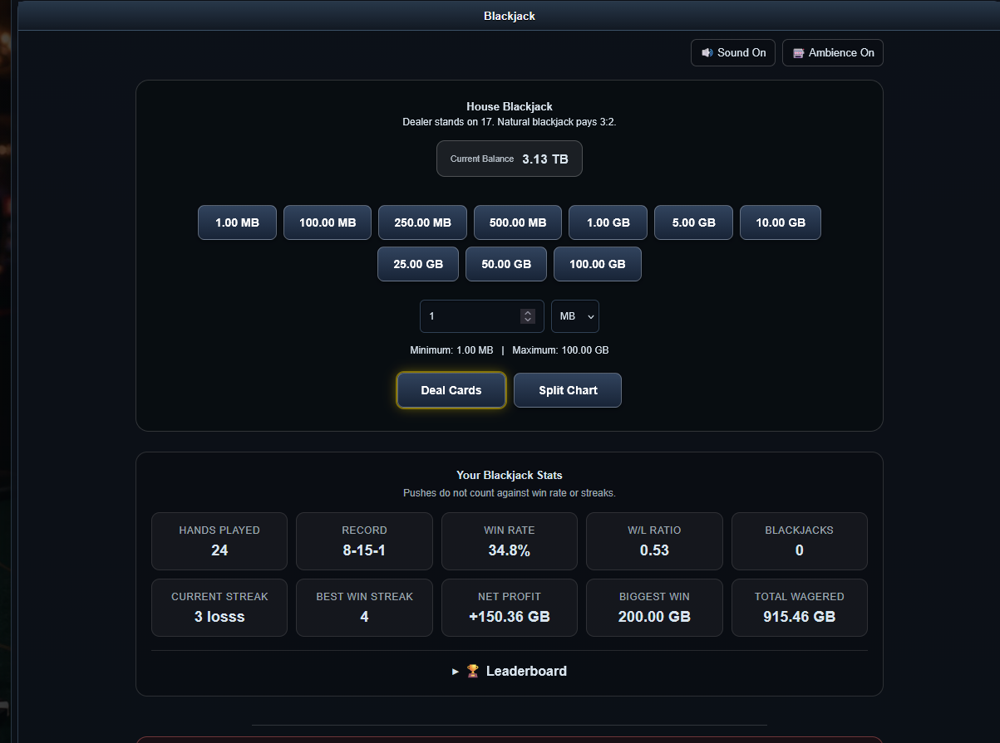

# TTv3 House Blackjack

A single-player **Blackjack game for TorrentTrader / TTv3** that lets
tracker members play against the house using their upload credit as
chips.

Built for modern PHP while remaining compatible with older TTv3
installations.



## Features

-   Single-player Blackjack against the house
-   Uses tracker upload credit as the player's balance
-   Configurable minimum and maximum wagers
-   MB / GB wager selection
-   Whole-number custom wagers
-   Quick-bet buttons automatically respect configured limits
-   Natural Blackjack pays **3:2**
-   Dealer stands on **17**
-   **Hit**
-   **Stand**
-   **Double Down**
-   **Split**
-   Split Aces support
-   Split-hand results and payouts
-   Split strategy chart
-   Repeat Bet and Change Bet controls
-   Card animations
-   Card placement, win, loss, push, Blackjack, and flip sounds
-   Casino room ambience with an independent on/off control
-   Sound preferences saved in the browser
-   Player statistics
-   Leaderboard
-   Admin-selectable player stat resets
-   CSRF protection
-   Transactional balance handling
-   One active house game per player
-   WebP playing-card artwork
-   AJAX-style gameplay without full-page reloads

## Player Statistics

The game tracks:

-   Hands played
-   Win / loss / push record
-   Win rate
-   Win/loss ratio
-   Current streak
-   Best win streak
-   Net profit
-   Biggest win
-   Total wagered
-   Natural Blackjacks

Pushes do not count against win rate or streaks.

## Betting Limits

Betting limits are controlled entirely through the TTv3 site
configuration:

``` php
$site_config['blackjack_min_bet'] = 1 * MB;
$site_config['blackjack_max_bet'] = 100 * GB;
```

The configured limits are enforced server-side.

They also apply to **Split** and **Double Down**, so neither action can
increase the total wager beyond the configured maximum.

Custom wagers use whole numbers only. For example:

``` text
1 MB
250 MB
1 GB
25 GB
```

Decimal custom wagers such as `1.3 GB` are not accepted.

Switching between MB and GB changes the wager unit without converting
the number displayed in the amount field.

## Blackjack Rules

-   Dealer stands on 17.
-   Natural Blackjack pays 3:2.
-   Normal wins pay 1:1.
-   Pushes return the wager.
-   Double Down is available on the player's initial two-card hand when
    sufficient credit is available and the doubled wager remains within
    the configured maximum.
-   Double Down draws exactly one additional card and then automatically
    stands.
-   Split is available only when the two original cards are the same
    rank.
-   Splitting requires an additional wager equal to the original wager.
-   Split hands are paid independently at 1:1.
-   A 21 after splitting is not treated as a natural Blackjack.
-   Split Aces receive one additional card per hand and then stand
    automatically.
-   Re-splitting is not currently supported.

## Requirements

-   TorrentTrader / TTv3
-   PHP **7.4 or newer**
-   PHP 8.x supported
-   Tested with PHP **8.4**
-   MySQL or MariaDB
-   MySQLi
-   Existing TTv3 user authentication
-   Existing `users.uploaded` upload-credit balance

## Installation

### 1. Install the database table

Run the SQL manually in your tracker database:

``` sql
CREATE TABLE `blackjack_games` (
    `id` bigint unsigned NOT NULL AUTO_INCREMENT,
    `user_id` int NOT NULL,
    `active_key` varchar(64) DEFAULT NULL,
    `wager` bigint unsigned NOT NULL DEFAULT 0,
    `status` enum('playing','settled') NOT NULL DEFAULT 'playing',
    `shoe` text NOT NULL,
    `shoe_pos` int unsigned NOT NULL DEFAULT 0,
    `player_cards` text NOT NULL,
    `dealer_cards` text NOT NULL,
    `player_points` tinyint unsigned NOT NULL DEFAULT 0,
    `dealer_points` tinyint unsigned NOT NULL DEFAULT 0,
    `result` enum('win','loss','push','blackjack') DEFAULT NULL,
    `payout` bigint unsigned NOT NULL DEFAULT 0,
    `profit` bigint NOT NULL DEFAULT 0,
    `created_at` datetime NOT NULL,
    `updated_at` datetime NOT NULL,
    `settled_at` datetime DEFAULT NULL,

    PRIMARY KEY (`id`),
    UNIQUE KEY `uniq_blackjack_active_key` (`active_key`),
    KEY `idx_blackjack_user` (`user_id`),
    KEY `idx_blackjack_user_status` (`user_id`,`status`),
    KEY `idx_blackjack_status` (`status`),
    KEY `idx_blackjack_settled` (`settled_at`)
) ENGINE=InnoDB
  DEFAULT CHARSET=utf8mb4
  COLLATE=utf8mb4_unicode_ci;
```

No database tables are created or altered automatically by the PHP game.

### 2. Add the Blackjack files

Place the Blackjack PHP and supporting files in your tracker
installation.

Playing-card artwork is expected under:

``` text
images/blackjack/cards/
```

The card images use **WebP** format.

### 3. Configure betting limits

Add the desired limits to your TTv3 configuration:

``` php
$site_config['blackjack_min_bet'] = 1 * MB;
$site_config['blackjack_max_bet'] = 100 * GB;
```

Change these values to suit your tracker economy.

### 4. Add sounds and ambience

The game supports Blackjack sound effects and casino-room ambience. Keep
the supplied sound assets in the paths referenced by `blackjack.php`.

Users can independently disable normal game sounds or room ambience.

## Upload Credit

The game treats the existing TTv3 `users.uploaded` value as the player's
Blackjack balance.

Wagers are deducted from upload credit and payouts are returned to
upload credit. Balance-changing game actions use database transactions
and row locking to protect wager operations.

This project does **not** use real money.

## Admin Stat Reset

Administrators can selectively reset an individual player's Blackjack
statistics without changing that player's upload balance or active hand.

The current implementation requires **user class 7 or higher** for this
function.

## Security

The game includes:

-   TTv3 login enforcement
-   CSRF tokens on game actions
-   Server-side wager validation
-   Config-enforced minimum and maximum bets
-   Transactional credit updates
-   Row locking during balance-changing actions
-   Per-user active-game protection
-   User ownership checks when loading hands
-   Server-side validation of Split and Double Down

Client-side controls are for convenience only; wager and game rules are
enforced by PHP.

## Compatibility

The game was written to work with the legacy TTv3 codebase while running
on modern PHP.

Current target:

``` text
PHP 7.4+
PHP 8.3
PHP 8.4
MySQL / MariaDB
```

## Notes

This is a house game: each logged-in player receives an independent
Blackjack game against the dealer. Multiple users can play
simultaneously without sharing a table or game state.

The project is intended as a fun tracker feature using virtual upload
credit.

## License

Use and modify this project according to the license included with the
repository.
